# 🏗️ Data Ingestion Guide: Building the Knowledge Base

This guide explains the technical decisions and implementation details of the data ingestion pipeline used for the HDB RAG Expert.

> [!NOTE]
> These ingestion components were architected and generated with the help of **Anti Gravity**.

---

## 1. The HDB Downloader (`hdb_downloader.py`)

The first step in our pipeline is to acquire the raw data. We target specific HDB pages relevant to eligibility and grants.

### Technical Decisions:
*   **Targeted Scraping**: We define a specific list of `HDB_URLS` to download. This ensures we only ingest high-quality, relevant source material rather than crawling the entire site.
*   **Politeness**: The downloader includes a `time.sleep(2)` between requests to be polite to the HDB servers and avoid rate limiting.
*   **Raw Storage**: Files are saved as raw HTML in `data/hdb_raw/`. This allows us to re-parse the data later without needing to re-download it.

---

## 2. The HTML Parser (`html_parser.py`)

The goal of the parser is to transform messy, unstructured HTML files into clean, context-aware JSON chunks suitable for retrieval.

### Technical Decisions:
*   **Targeted Cleaning**: We use `BeautifulSoup` to strip away "junk" tags such as `<script>`, `<style>`, `<nav>`, and `<footer>`. This reduces noise and token usage in the LLM.
*   **Structural Awareness**: Instead of plain text extraction, the parser uses a "Heading Marker" strategy. It injects markers like `___SECTION_START___ [Heading] ___SECTION_END___` into the text stream.
*   **Smart Chunking**:
    *   **Context Preservation**: When the text is chunked, the parser identifies the last heading seen for each chunk. This ensures that every chunk knows which **Section** it belongs to (e.g., "Eligibility" or "Grant Amounts").
    *   **Overlap**: We use a `200` character overlap between chunks to prevent losing context at boundary points where a sentence might be cut off.
*   **Metadata Enrichment**: Every chunk is stored with its source file path, document ID, and section name, allowing the RAG system to provide better citations.

---

## 3. The QA Generator (`qa_generator.py`)

To optimize the DSPy system, we need a "training set" of high-quality Question-Answer pairs. This script automates that process.

### Technical Decisions:
*   **DSPy-Powered Generation**: We use a DSPy `Signature` (`GenerateRAGUsageExample`) to define the task. This ensures structural consistency and allows us to easily swap models if needed.
*   **Groundedness by Design**: The generator uses a `ChainOfThought` module. The signature explicitly instructs the model to generate questions and answers **answerable ONLY from the provided context**.
*   **Data Quality Filtering**: We filter out chunks that are too short (under 100 characters) to ensure the LLM has enough information to generate a meaningful, non-trivial question.
*   **Bootstrap Preparation**: The output (`qa_pairs.json`) is specifically formatted to be used as a `trainset` for DSPy optimizers like `BootstrapFewShot`.

---

## 4. Data Flow Overview

```mermaid
graph LR
    Web[HDB Website] --> Downloader[hdb_downloader.py]
    Downloader --> HTML[Raw HTML]
    HTML --> Parser[html_parser.py]
    Parser --> Chunks[chunks.json]
    Chunks --> Gen[qa_generator.py]
    Gen --> QA[qa_pairs.json]
    QA --> DSPy[DSPy Compilation]
    
    style Downloader fill:#f96,stroke:#333
    style Parser fill:#f96,stroke:#333
    style Gen fill:#3498db,color:#fff,stroke:#333
```

### Key Takeaway:
By using a targeted downloader, a section-aware parser, and a grounded QA generator, we bridge the gap between "unstructured web data" and a "compiled AI program."
