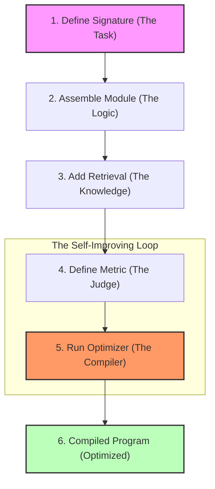

# 🧠 DSPy Technical Guide: Programming vs. Prompting

This document provides a deep technical explanation of the **DSPy** framework and how it was used to build the HDB RAG Expert.

---

## DSPy Workflow at a Glance



---

## 1. The Paradigm Shift: Declarative AI

DSPy (Declarative Self-improving Language Programs, pythonic) is founded on the idea that **prompts are brittle and fragile**. Instead of manually editing strings, DSPy allows you to define the **logic** of your application and then **compile** it into an optimized state.

### Key Philosophy:
*   **Separation of Concerns**: You define the *task* (what to do) separately from the *implementation* (the prompts and model calls).
*   **Data-Driven Optimization**: Prompts are treated like "model weights" that can be tuned by an optimizer using a dataset.

---

## 2. Project Implementation Reference

To build the HDB RAG Expert, we used three fundamental abstractions: **Signatures**, **Modules**, and **Optimizers**.

### A. Signatures (`src/signatures.py`)
Signatures define **what** a task is. We defined three specific signatures for this project:

1.  **`RAGSignature`**: The core contract for answering user questions.
    ```python
    class RAGSignature(dspy.Signature):
        """Answer the question based on the provided HDB context..."""
        context = dspy.InputField(desc="Relevant HDB documentation snippets")
        question = dspy.InputField()
        answer = dspy.OutputField(desc="A factual answer...")
    ```
2.  **`GenerateRAGUsageExample`**: Used by the data ingestion pipeline to synthetically generate training data.
3.  **`JudgeQA`**: Used by the optimizer (LLM-as-a-judge) to evaluate the correctness of answers.

### B. Modules (`src/model.py`)
Modules are the "logic" units. Our `HDBRAG` module connects retrieval with generation.

```python
class HDBRAG(dspy.Module):
    def __init__(self, index, k=3):
        super().__init__()
        # 1. Retrieval Layer
        self.retrieve = HDBRetriever(index, k=k)
        # 2. Generation Layer (Predictor)
        self.generate_answer = dspy.Predict(RAGSignature)
    
    def forward(self, question):
        passages = self.retrieve(question)
        context_strings = [p.long_text for p in passages]
        # 3. Execution
        prediction = self.generate_answer(context=context_strings, question=question)
        return dspy.Prediction(answer=prediction.answer, context=context_strings)
```

### C. Optimizers (`rag_optimizer.py`)
Optimizers are the most powerful part of DSPy. They take your program and automatically improve it.

In this project, we used **MIPROv2** (Multiprompt Instruction PRoposal Optimizer), which is state-of-the-art for refining both *instructions* and *few-shot examples*.

---

## 3. The Optimization Process

The "Magic" of the HDB RAG Expert lies in how it was compiled.

### The Objective
We wanted to maximize **Correctness** and **Groundedness**. To do this, we defined a metric using an **LLM-as-a-Judge**:

```python
# From rag_optimizer.py
def get_metric(judge_lm):
    judge = dspy.Predict(JudgeQA)
    def metric(example, pred, trace=None):
        # ... validation logic ...
        result = judge(
            question=example.question,
            gold_answer=example.answer,
            predicted_answer=pred.answer
        )
        return float(result.is_accurate)
    return metric
```

### The Optimizer: MIPROv2
We chose `MIPROv2` because it doesn't just pick examples; it also explores different *instructions* (prompts) to find the best way to explain the task to the model.

#### How it works:
1.  **Bootstrapping**: It runs our `HDBRAG` module on the training set (`data/qa_pairs.json`).
2.  **Instruction Proposal**: It looks at the successful and failed traces and proposes new prompts (Instructions).
3.  **Bayesian Search**: It systematically tests combinations of Instructions + Few-Shot Examples to maximize the `JudgeQA` score.

```python
# From rag_optimizer.py
teleprompter = dspy.MIPROv2(
    metric=metric,
    auto='light',          # Optimize instructions & demos
    max_bootstrapped_demos=1,
    max_labeled_demos=1
)

optimized_rag = teleprompter.compile(
    rag,
    trainset=train_examples,
    minibatch=True
)
```

---

## 4. Advanced: Why this Beats LangChain?

| Feature | **LangChain** | **DSPy** |
| :--- | :--- | :--- |
| **Prompting** | Manual (String templates). | Automatic (Compiled from Signatures). |
| **Logic** | Fixed "Chains". | Dynamic, optimizable Programs. |
| **Scaling** | Brittle; one prompt change breaks everything. | Robust; re-compile whenever data or model changes. |
| **Optimization** | Trial and error. | Programmatic (BootstrapFewShot, MIPRO, etc.). |

---

## 5. Summary for the HDB Project
By using DSPy, we didn't just build a "chatbot" that reads HDB files. We built a **Self-Improving RAG Pipeline**.

1.  **Signature**: We defined what an "HDB Answer" looks like using `RAGSignature`.
2.  **Module**: We encapsulated the retrieval and generation logic in `HDBRAG`.
3.  **Compilation**: We used **MIPROv2** and an **LLM Judge** (`JudgeQA`) to scientifically explore and select the best prompts for our local model.

**Key Technical Takeaway**: DSPy turns your LLM system into an **optimizable program** where the "Prompts" are simply the current best configuration discovered by the compiler.
