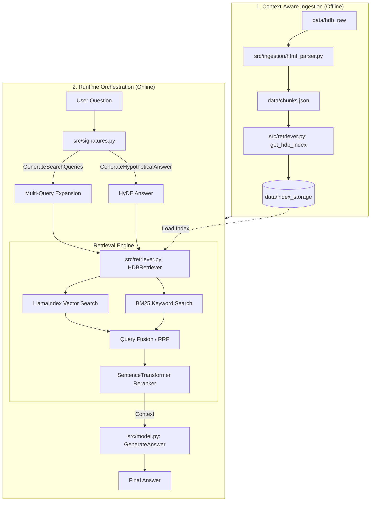
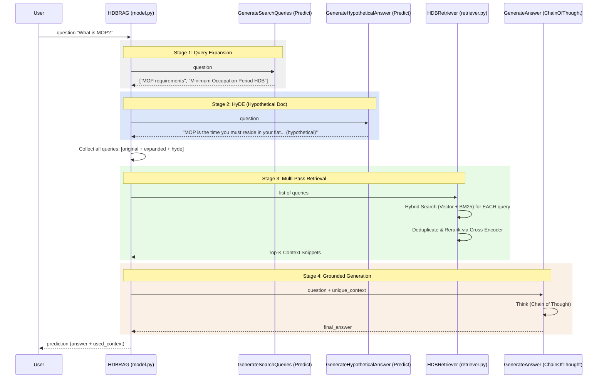

# HDB RAG System Architecture (Grounded View)

This document provides a grounded overview of the HDB RAG system, mapping logical components to their physical implementation in the codebase.

## 1. Project Structure

The project is organized into a modular structure where data, logic, and evaluation are clearly separated.

```text
.
├── app.py                  # Main Chatbot UI (Gradio/Streamlit)
├── rag_optimizer.py        # DSPy optimization script (Program Compilation)
├── compare_retrieval.py    # Side-by-side comparison of Naive vs Improved retrieval
├── data/
│   ├── chunks.json         # Processed semantic chunks (Output of ingestion)
│   ├── index_storage/      # Persistent LlamaIndex vector store
│   ├── hdb_raw/            # Source HTML documentation
│   └── qa_split.json       # Train/Dev/Test dataset for DSPy optimization
├── docs/                   # Study guides and architectural documentation
└── src/
    ├── ingestion/
    │   └── html_parser.py  # Structure-aware chunking logic
    ├── signatures.py       # DSPy Signatures (QueryExpansion, HyDE, Answer)
    ├── retriever.py        # Hybrid Search + BM25 + Reranking logic
    └── model.py            # Core RAG Module (HDBRAG) and pipeline orchestration
```

---

## 2. Integrated System Flow (Vertical View)

The diagram below showing the vertical progression from offline data preparation to the online runtime orchestration.



---

## 3. Detailed DSPy Module Flow (Logic-Level)

The following diagram details the sequence of execution within the `HDBRAG` module in `src/model.py`, showing how the various DSPy signatures interact to deliver a grounded answer.



### Logical Breakdown of DSPy Components

| Component | Class | Signature | Responsibility |
|-----------|-------|-----------|----------------|
| **`generate_queries`** | `dspy.Predict` | `GenerateSearchQueries` | Breaks down complex questions into searchable terms to maximize "recall." |
| **`generate_hyde`** | `dspy.Predict` | `GenerateHypotheticalAnswer` | Bridges the "query-answer" gap by searching for documents similar to the *intended* answer. |
| **`retriever`** | `dspy.Retrieve` | N/A (Custom) | Operates as a black-box multi-query retrieval engine using LlamaIndex. |
| **`generate_answer`** | `dspy.ChainOfThought`| `GenerateAnswer` | Synthesizes the final response, ensuring every claim is backed by retrieved snippets. |

---

## 3. Core Component Implementation

### A. Context-Aware Ingestion (`src/ingestion/html_parser.py`)
- **Logic**: Uses BeautifulSoup to extract structure. Instead of splitting by character count, it splits at header tags (`h1-h6`) and paragraph boundaries.
- **Grounded Benefit**: Prevents the system from retrieving a "fragment" of a sentence. It injects the `[Section Header]` into the text itself, so the embedding model has more context to work with.

### B. Two-Stage Retrieval (`src/retriever.py`)
- **Hybrid Retrieval**: Combines `VectorStoreIndex` (semantic) with `BM25Retriever` (keyword).
- **Reranker**: Uses `SentenceTransformerRerank` with the `cross-encoder/ms-marco-TinyBERT-L-2-v2` model. This is the "brain" that filters out irrelevant matches from the hybrid pool.
- **Persistence**: Storage is handled via `StorageContext` and persisted to `data/index_storage`.

### C. DSPy Program Orchestration (`src/model.py` & `src/signatures.py`)
- **Model**: The `HDBRAG` module in `model.py` orchestrates the entire pipeline. It's a `dspy.Module` that can be "compiled" (optimized).
- **Transformation**: Before searching, `model.py` calls `generate_queries` and `generate_hyde` (defined in `signatures.py`) to expand the search scope.
- **Deduplication**: Since multiple queries are used, `model.py` implements a set-based deduplication to ensure the LLM doesn't see the same text twice.

### D. Optimization & Evaluation (`rag_optimizer.py`)
- **Process**: This script loads `data/qa_split.json` and uses the `MIPROv2` optimizer to tune the instructions for the signatures in `src/signatures.py`.
- **Result**: Generates `data/optimized_rag.json`, which contains the "compiled" prompts that perform significantly better than the hand-written versions.
